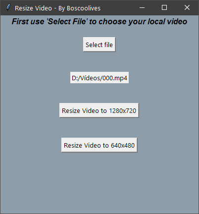

# Video Resizer GUI executable
Pequeño programa para hacer reescalado de vídeos a resoluciones 720p y 480p.
Se ha diseñado con el fin de tener una herramienta rápida que cumpla exactamente una función especifica como es obtener este tipo de resoluciones a partir de cualquier video de entrada.

Ha surgido esta necesidad a partir de observar el gran peso de los videos de 'grabación de pantalla' en Windows. Estos son grabados como mínimo a 1080p. No existe la forma de grabar nativamente desde Windows a resoluciones menores.
Si estos videos se quieren distribuir por canales con un máximo de MB por archivo, normalmente nos encontramos con el problema que no va a dejar enviarlo (WhatsApp Web, Discord...) Una solución es bajar la resolución si no nos importa perder calidad de imagen.
 
